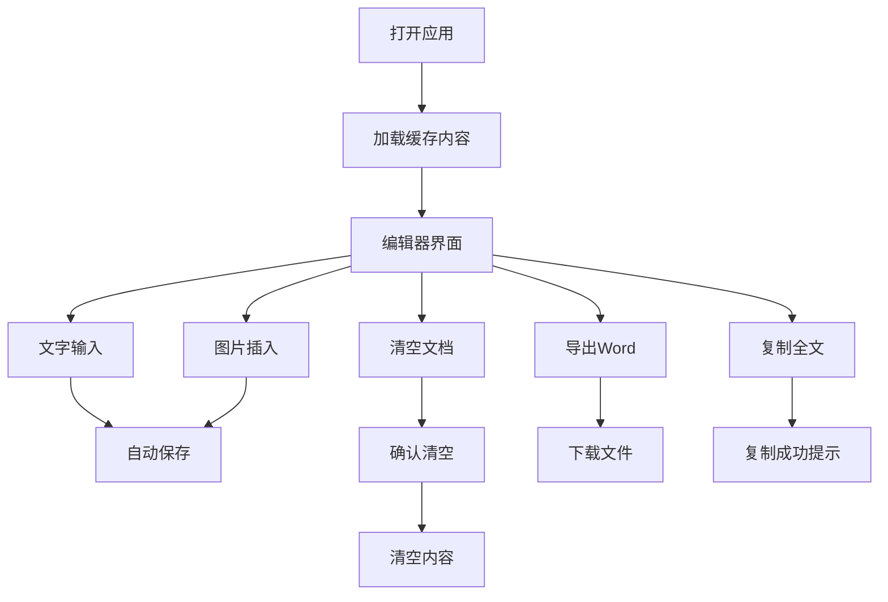

# 草稿笔记(DraftNote) - 产品需求文档

## 1. 产品概述

草稿笔记(DraftNote)是一个极简的临时记录Web应用，旨在为用户提供快速、便捷的文字和图片记录功能，满足用户临时记录的需求，类似于现实生活中的草稿纸。

* 目标用户：需要快速记录临时内容的职场人士、学生、自由职业者等

* 产品价值：提供无需注册、即开即用的临时记录工具，保护用户隐私的同时满足快速记录需求

## 2. 核心功能

### 2.1 用户角色

本产品无需用户注册，所有用户均为匿名用户，享有相同的功能权限。

### 2.2 功能模块

草稿笔记应用包含以下核心页面：

1. **编辑器页面**：富文本编辑区域、功能按钮栏、状态提示区域

### 2.3 页面详情

| 页面名称  | 模块名称   | 功能描述                               |
| ----- | ------ | ---------------------------------- |
| 编辑器页面 | 富文本编辑器 | 支持文字输入、复制粘贴、图片插入(上传/拖拽)、自动保存到浏览器缓存 |
| 编辑器页面 | 功能按钮栏  | 清空文档(含确认提示)、导出Word文档、复制全文到剪贴板      |
| 编辑器页面 | 状态提示区域 | 显示操作成功提示、错误信息、帮助说明                 |
| 编辑器页面 | 缓存管理   | 自动加载上次保存内容、实时保存用户输入到LocalStorage   |

## 3. 核心流程

用户操作流程：

1. 用户打开应用链接，直接进入编辑器界面
2. 系统自动加载上次保存的内容(如果存在)
3. 用户可以直接开始文字输入或图片插入
4. 系统实时保存内容到浏览器缓存
5. 用户可以使用功能按钮进行清空、导出、复制操作
6. 用户关闭页面时内容自动保存，下次打开时恢复

## 4. 用户界面设计

### 4.1 设计风格

* 主色调：白色背景(#FFFFFF)，深灰色文字(#333333)

* 次要色彩：浅灰色边框(#E0E0E0)，蓝色按钮(#007BFF)

* 按钮样式：圆角矩形，悬停效果，简洁现代

* 字体：系统默认字体，编辑器14px，按钮12px

* 布局风格：极简卡片式布局，顶部导航栏

* 图标风格：简洁线条图标，统一视觉风格

### 4.2 页面设计概览

| 页面名称  | 模块名称   | UI元素                            |
| ----- | ------ | ------------------------------- |
| 编辑器页面 | 顶部功能栏  | 白色背景，浅灰边框，按钮水平排列，间距8px，高度48px   |
| 编辑器页面 | 富文本编辑器 | 白色背景，无边框，最小高度400px，字体14px，行高1.6 |
| 编辑器页面 | 状态提示   | 绿色成功提示，红色错误提示，3秒自动消失，右上角位置      |
| 编辑器页面 | 确认对话框  | 模态框样式，白色背景，阴影效果，居中显示            |

### 4.3 响应式设计

* 桌面优先设计，移动端自适应

* 支持触摸交互优化

* 断点：768px以下为移动端布局

* 移动端按钮增大，间距调整，编辑器全屏显示

