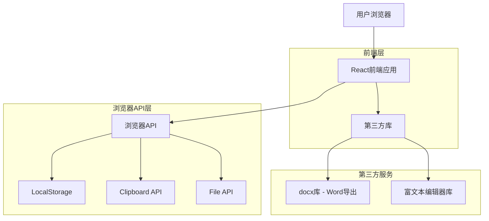
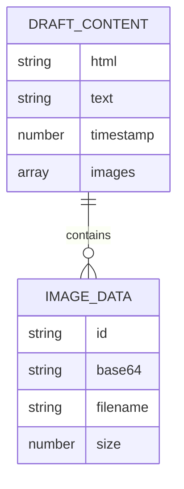

# 草稿笔记(DraftNote) - 技术架构文档

## 1. 架构设计



## 2. 技术描述

* 前端：React\@18 + CSS3 + Vite

* 后端：无

* 存储：浏览器LocalStorage

* 构建工具：Vite

* 第三方库：docx(Word导出)、react-quill或类似富文本编辑器

## 3. 路由定义

| 路由 | 用途                |
| -- | ----------------- |
| /  | 主页面，包含富文本编辑器和所有功能 |

## 4. API定义

### 4.1 浏览器存储API

**LocalStorage操作**

保存内容：

```javascript
localStorage.setItem('draftNote_content', JSON.stringify({
  html: string,
  text: string,
  timestamp: number
}))
```

加载内容：

```javascript
const content = JSON.parse(localStorage.getItem('draftNote_content') || '{}')
```

### 4.2 文件操作API

**图片上传处理**

```javascript
const handleImageUpload = (file: File) => {
  const reader = new FileReader()
  reader.onload = (e) => {
    // 插入图片到编辑器
  }
  reader.readAsDataURL(file)
}
```

**Word文档导出**

```javascript
const exportToWord = (content: string) => {
  // 使用docx库生成Word文档
  const doc = new Document({
    sections: [{
      properties: {},
      children: [/* 解析HTML内容 */]
    }]
  })
  
  // 触发下载
  Packer.toBlob(doc).then(blob => {
    saveAs(blob, 'draft-note.docx')
  })
}
```

**剪贴板操作**

```javascript
const copyToClipboard = async (text: string) => {
  try {
    await navigator.clipboard.writeText(text)
    return true
  } catch (err) {
    // 降级方案
    return false
  }
}
```

## 5. 数据模型

### 5.1 数据模型定义



### 5.2 数据结构定义

**草稿内容数据结构**

```typescript
interface DraftContent {
  html: string;           // 富文本HTML内容
  text: string;           // 纯文本内容
  timestamp: number;      // 最后保存时间戳
  images: ImageData[];    // 图片数据数组
}

interface ImageData {
  id: string;            // 图片唯一标识
  base64: string;        // 图片base64数据
  filename: string;      // 原始文件名
  size: number;          // 文件大小(字节)
}
```

**LocalStorage存储键值**

```javascript
// 主要内容存储
const STORAGE_KEYS = {
  CONTENT: 'draftNote_content',
  SETTINGS: 'draftNote_settings',
  TEMP_IMAGES: 'draftNote_temp_images'
}
```

**组件状态管理**

```typescript
interface AppState {
  content: DraftContent;
  isLoading: boolean;
  isSaving: boolean;
  notification: {
    message: string;
    type: 'success' | 'error' | 'info';
    visible: boolean;
  };
}
```

